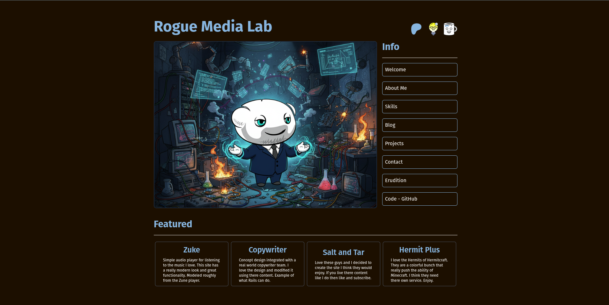
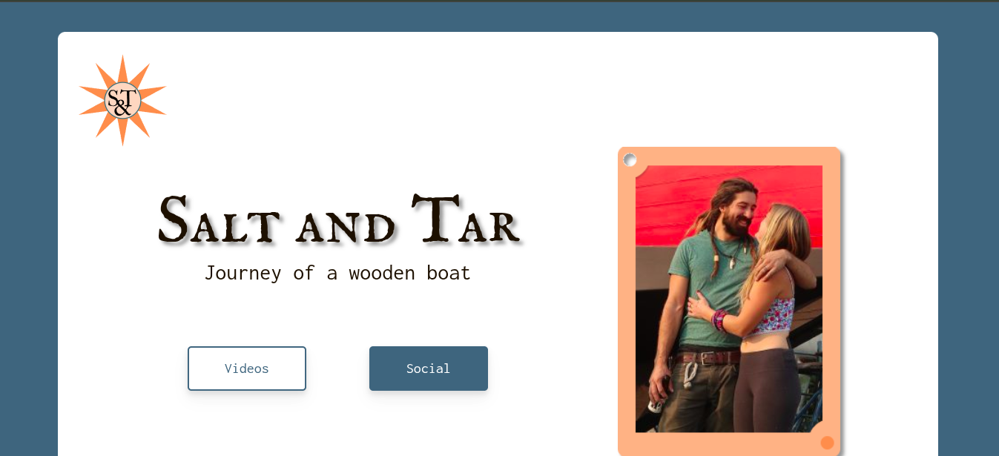
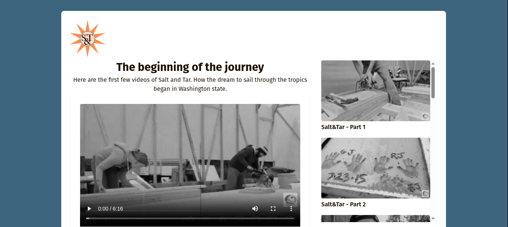
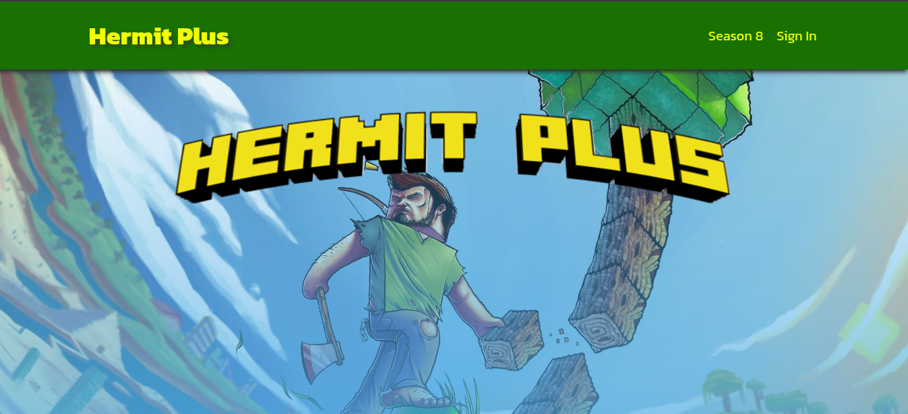
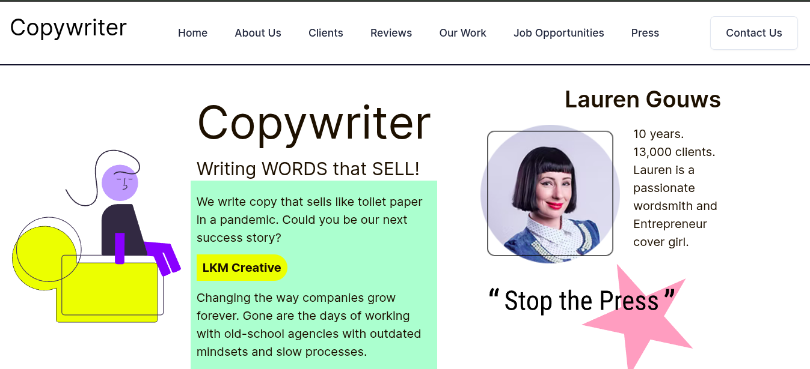
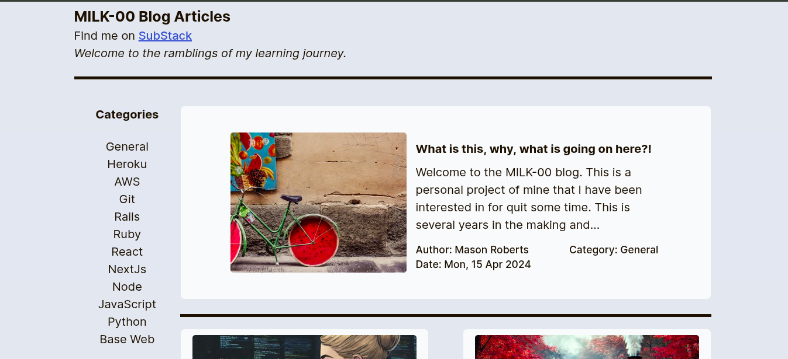

# Rogue Media Lab

*Formerly MILK-00*



With the new studio up, it is time to work on the portfolio. Formerly MILK-00, this project holds a lot of promise and already has a lot of functionality. I liked the design and how it works. I love the concept of feeling like you stepped into a different site for the various featured projects. These are working concepts in various stages of development, but those shiny parts are shown here, as you may see them if you visited the app. I love this concept. I can save money by working them into the same platform, but you still feel like you are visiting a new place. Hosting each of these would be a strain on my tiny budget.

You need to know that I have taken liberties with various rights to bring these concepts to you. I hope I have done them justice. I love them all so much and wish no harm to any of them. I simply want to show everyone what I can do, and them, that there could be a different way. With Salt and Tar I have ensured you can get to their original content and provided those various social links that they manage. I feel this is an improvement as you can get to all of them from one spot. With the music, and images for the music, I have either changed the sound, adding scratches and pops for that older feel, or modified images with AI in some way. Most of the time making live images. None of that is enough and I should provide a reference to the artist. I apologize if I offend anyone. Early in the build I was focused on making it work. I have grown.

The initial view utilizes Turbo Frames. Clicking a link on the right sidebar will populate the frame on the left. These frames will give information, provide external links, and provide a form for sending internal messages. These frame views are labeled info.

## Feature Projects

There are many projects I love and keep coming back to. With Rails I have been able to get them pulled together into one place to enjoy. Here is some information on each.

### Salt and Tar



This is a YouTube channel for sailing. Ruth and Garrett have built Rediviva and the channel starts from the very beginning. Like many content creators, they juggle several accounts on various platforms. I thought they could use a site / app that gave them features they would use and enjoy while reducing the account overhead. For me, I want to enjoy their videos without the distractions of YouTube. I want the design to be a little different. I want the videos to have an old feel for the build and I want them to be framed like a polaroid picture. I would love to be able to book an overnight berthing or a day sail with them. I would love to bid on things when they are replaced on Rediviva. I would love to purchase merch or support them directly. All of this I will build into the remake. It is built with Rails, styled with Tailwind, larger files are stored in S3, and PostgreSQL is the database. This is a concept, of course. I hope everyone enjoys, and all the information is provided so you can easily support them. If I am honest, having just that home page that includes all those support links in one place, is an improvement.



Here is the Archive that includes the first re-worked videos from the building of Rediviva in Washington state. They have an old feel with grain and static lines. The original video is linked with the YouTube icon below the main video in the polaroid frame.

### Hermit Plus



Minecraft is a thing. The Hermits have really made it a thing to enjoy. This group of talented players have figured it out. I wanted a different way to enjoy them. Wanted them pulled together into one location. Like Netflix, but with only the Hermits. On YouTube they are spread out in all the noise. Then there is the fan art, the merch, the music for some. They deserve something more.

Season browsing, a hermit roster with per-hermit profiles, crew/special collections, favorites, and watch-progress tracking. Video metadata is pulled from the YouTube Data API v3 — see [Environment Variables](#environment-variables).

### Copywriter



This project and Barbershop were old WordPress projects that I just loved the design. Several months back I started the clean up of my LinkedIn and decided to remake this one as all the others were lost. It then moved to here as I wrapped everything together. I did a little research and found a copywriter and decided to rebuild their site with my design. This is a concept but they are real. Whether you love or hate my work, I encourage you to give them a look.

### Blog



I have recently started a SubStack account. I finally have this blog up and running. This is intended to help me and others learn these concepts as I continue this journey. They will provide a glimpse of both my sense of humor and knowledge of design and development.

### Zuke

A music player for the songs I actually own, modeled roughly on the Zune. Songs, albums, artists, genres, playlists, and full-text search live at `/zuke`. Liked tracks sync in from SoundCloud, and artwork can be customized per track from the admin. Playback prefers local files and falls back to resolved SoundCloud streams.

### CarUs

A two-sided auto-shop and car-owner platform at `/carus`. Car owners register, add vehicles, get a digital manual and service history, request bookings, and talk to the shop. Technicians get a manager portal — customers, services, bookings, weekly shop reports, a leaderboard, and paid-time tracking — plus mobile job tools with an AI-assisted lookup and parts cross-referencing.

### Restaurants

A multi-tenant restaurant platform mounted under a slug scope (`/:restaurant_slug`). One codebase serves multiple restaurant sites — menu, about, contact, cart, and online ordering — each with its own branding, all managed from the admin namespace.

### Rocky

A small AI assistant (`/rocky/chat`, `/rocky/messages`, `/rocky/tts`, `/rocky/tone`) wired to static pages. Gives the studio a live, talking front door.

### The Lab

`/lab` is the client-facing hire/contact page. `/studio` is the internal-facing overview. `/info/*` holds the resume-style pages — welcome, vibe, skills, erudition.

## API

A small agent-facing JSON API exists for music management, used by the Hermes agent to upload tracks and create playlists:

```
POST /api/v1/songs
POST /api/v1/playlists
```

Authenticated with a bearer token via `ApiAuth` (`app/controllers/concerns/api_auth.rb`). The token is read from Rails credentials (`api_token`) or `ZUKE_API_TOKEN`, compared with `secure_compare`, and is deliberately kept out of this repository.

## Getting Started

* **Ruby version**
  3.3.7

* **System dependencies**
  Tailwind, PostgreSQL, Ruby 3.3.7, Rails 8, Devise, aws-s3, Active Storage and Action Text.

* **Configuration**
  Standard Rails configuration with Tailwind and PostgreSQL. Application secrets are managed with Rails encrypted credentials — `config/credentials.yml.enc` is committed, `config/master.key` is **not** and must never be.

* **Database creation**
  `database.yml` carries local development defaults (`localhost` / `postgres`) so a fresh clone boots without extra setup. Production uses `DATABASE_URL` from the environment. Do not reuse these local defaults anywhere real.

* **Database initialization**
  `db:create`, `db:migrate`, `db:seed`
  The seed file includes a generic admin create and some dummy projects, skill pills and such.

* **How to run the test suite**
  Standard Rails system tests. Very few tests currently.

* **Deployment**
  Procfile and package.json are set for Heroku deployment. Updated per Dependabot requests.

### Environment Variables

Never commit these. Set them in `.env` locally (gitignored) or as Heroku config vars in production.

| Variable | Required for | Notes |
|---|---|---|
| `YOUTUBE_API_KEY` | Hermit Plus | YouTube Data API v3. Get one at https://console.cloud.google.com/apis/credentials — free tier is 10,000 units/day. |
| `SOUNDCLOUD_CLIENT_ID` | Zuke | Falls back to encrypted credentials `:soundcloud, :client_id`. |
| `SOUNDCLOUD_CLIENT_SECRET` | Zuke | Falls back to encrypted credentials `:soundcloud, :client_secret`. |
| `ZUKE_API_TOKEN` | API v1 | Alternative to credentials `api_token`. Generate with `rails runner "puts SecureRandom.hex(32)"`. |
| `DATABASE_URL` | Production | Heroku provides this. |

Add a credential with:

```bash
bin/rails credentials:edit
```

## Security

Security reports are welcome. If you find an exposed credential in this repository or its history, please do not open a public issue — contact me directly first so it can be rotated before disclosure.

This repository is **public**. That means:

* No secret ever belongs in a commit. Deleting the file afterward does not remove it from history.
* `.gitignore` covers `.env*`, `config/master.key`, and token files. Check it before adding anything credential-shaped.
* If a secret does land in a commit, **rotate it first**, then scrub history. Rotation is the fix; the scrub is cleanup.

## License

MIT